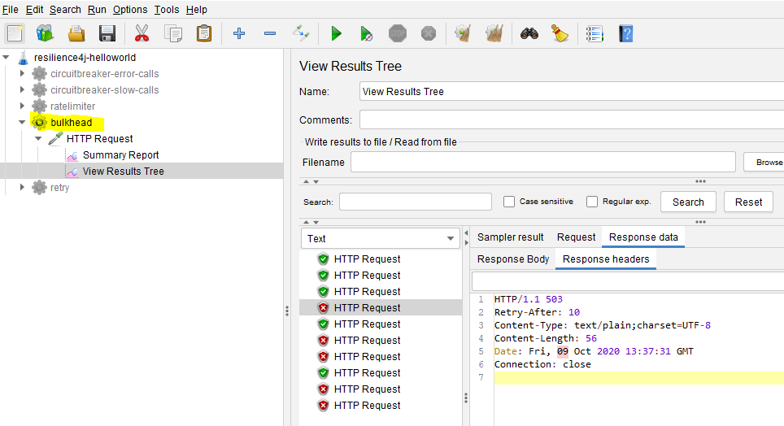

# Resilience4j- Session-2  Limit of number of concurrent requests to RESTAPI using bulkhead 
In  this tutorial we are going to learn how to limit number of concurrent (parallel) requests that a restapi can handle. 

Overview
- Using **Bulkhead** to limit the number of concurrent calls to a  service.
- This functionality can be achieved easily with annotation **@Bulkhead** without writing explicit code.
 

Overview
- User makes a call to greeting RESTAPI to get a greeting message.
- **greeting** api can only handle can only handle 5  concurrent requests at a given time.
- This limitation can be set on greeting method using annotation **@Bulkhead**
- if the method receives more than 5 concurrent requests at a given time  **io.github.resilience4j.bulkhead.BulkheadFullException** 
is thrown.The user is served with HTTP status code 503 and asked to retry after 10 seconds.  
# Source Code 
- [https://github.com/balajich/resilience4j-helloworld/tree/master/bulkhead](https://github.com/balajich/resilience4j-helloworld/tree/master/bulkhead) 
# Video
[](https://www.youtube.com/watch?v=35fTH9G8gT0)
- https://youtu.be/35fTH9G8gT0
# Architecture

# Prerequisite
- User should have basic understanding of RESTAPI and Spring boot
- JDK 1.8 or above
- Apache Maven 3.6.3 or above
# Build
- ``` cd  resilience4j-helloworld ```
- ``` mvn clean install ```

# Running RESTAPI
- REST API Server: ``` java -jar .\bulkhead\target\bulkhead-0.0.1-SNAPSHOT.jar ```

# Using JMeter to generate more than 5 concurrent calls
- JMeter Script is provided to generate  calls
-  Import **resilience4j-helloworld.jmx** and run **bulkhead** thread group.
- Obeseve only 5 concurrent calls are successful rest of them fail with **503**
- 
# Code
Include following artifacts as dependency for spring boot restapi application. **resilience4j-spring-boot2,
spring-boot-starter-actuator,spring-boot-starter-aop**
**pom.xml** of  bulkhead 
```xml
<dependency>
    <groupId>io.github.resilience4j</groupId>
    <artifactId>resilience4j-spring-boot2</artifactId>
    <version>1.4.0</version>
</dependency>
<dependency>
    <groupId>org.springframework.boot</groupId>
    <artifactId>spring-boot-starter-actuator</artifactId>
</dependency>
<dependency>
    <groupId>org.springframework.boot</groupId>
    <artifactId>spring-boot-starter-aop</artifactId>
</dependency>
```
In **application.yml**  define the behavior of bulkhead module
- maxConcurrentCalls: Number of maximum concurrent calls that it should handle.
- maxWaitDuration: Duration for which request should wait.
```yaml
resilience4j:
    bulkhead:
        configs:
            default:
                maxConcurrentCalls: 5
                maxWaitDuration: 0
        instances:
            greetingBulkhead:
                baseConfig: default
```
```java
        @GetMapping("/greeting")
        @Bulkhead(name = "greetingBulkhead", fallbackMethod = "greetingFallBack")
        public ResponseEntity greeting(@RequestParam(value = "name", defaultValue = "World") String name) {
            return ResponseEntity.ok().body("Hello World: " + name);
        }
    
    
        public ResponseEntity greetingFallBack(String name, io.github.resilience4j.bulkhead.BulkheadFullException ex) {
            System.out.println("BulkHead applied no further calls are accepted");
            HttpHeaders responseHeaders = new HttpHeaders();
            responseHeaders.set("Retry-After", "10"); //retry after 10 seconds
    
            return ResponseEntity.status(HttpStatus.SERVICE_UNAVAILABLE)
                    .headers(responseHeaders) //send retry header
                    .body("Too many concurrent requests- Please try after some time");
        }
```

# References
- https://developer.mozilla.org/en-US/docs/Web/HTTP/Status
- https://www.baeldung.com/resilience4j
- Hands-On Microservices with Spring Boot and Spring Cloud: Build and deploy Java microservices 
using Spring Cloud, Istio, and Kubernetes -Magnus Larsson
# Next Tutorial
How to deploy microservices using docker
- https://github.com/balajich/spring-cloud-session-6-microservices-deployment-docker