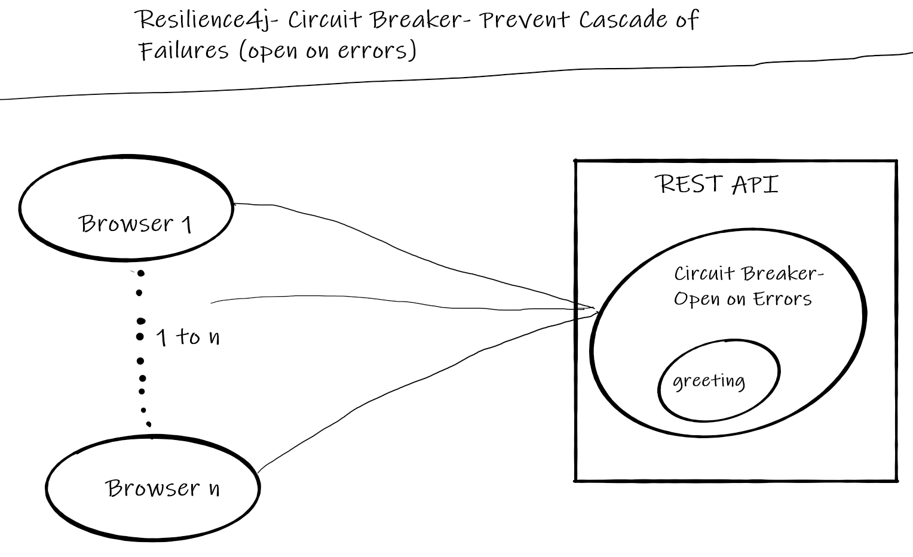
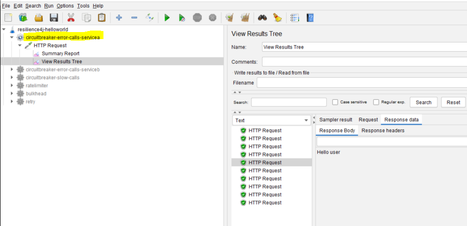

# Resilience4j Session-6  Monitoring CircuitBreaker Events with Prometheus and visualizing them in Grafana
In  this tutorial we are going to learn how to monitor events that are generated by Resilience4j library and visualize them 
in a dashboard. Here we are going to use **Prometheus** to monitor events and **Grafana** for visualization.

In this example we are going to monitor **Circuit Breaker** events that are generated by **SeviceA** when it is receiving more errors
than those are expected from **ServiceB**.

Overview
- User makes a call to get greeting message from  REST API ServiceA
- ServiceA calls ServiceB to fetch greeting message
- Because of some random issue 50% of calls to ServiceB results in failure
- When ever ServiceA gets error message from ServiceB instead of returning error message to client, it will return message from 
a cache.
- When ever error rate increases beyond 50% ServiceA doesn't call ServiceB until ServiceB recovers or **waitDurationInOpenState** is finished.
- ServiceA uses **CircuitBreaker** module from **Resilience4j**. When ever there is a change in circuit state and event is generated.
- For every 5 seconds interval Prometheus asks  ServiceA for Circuit Breaker events using REST API
- For every 5 seconds interval Garafana updates its dashboard with newly generate event count.
**Note:** We are not going discuss details of Circuit Breaker in this session. Please refer to my previous sessions. 
# Source Code 
- [https://github.com/balajich/resilience4j-helloworld/tree/master/circuitbreaker-error-calls](https://github.com/balajich/resilience4j-helloworld/tree/master/circuitbreaker-error-calls) 
# Video
[](https://www.youtube.com/watch?v=vKIELihjRjY)
- https://youtu.be/vKIELihjRjY**
# Architecture

# Prerequisite
- JDK 1.8 or above
- Apache Maven 3.6.3 or above
- Vagrant 2.2.9 or above- (To start,stop and manage virtual machines)
- Docker version 19.03.13 or above
- docker-compose version 1.18.0 or above
# Build
- ``` cd  resilience4j-helloworld\circuitbreaker-error-calls-grafana-prometheus-monitor ```
- ``` mvn clean install ```
# Running  Prometheus and Grafana in docker
- ``` cd  resilience4j-helloworld\circuitbreaker-error-calls-grafana-prometheus-monitor ```
- ``` vagrant up ``` # wait till the virtual machine is up
- ```vagrant ssh -- -R 8080:localhost:8080 ``` # Take ssh to virtual machine and route 
requests from guest 8080 to host 8080 using ssh tunnel. Prometheus that is running in
docker in the virtual machine should be able to access ServiceB tomcat to fetch metrics.
- ```sudo su - ``` # Change to root user
- ``` cd /vagrant/circuitbreaker-error-calls-grafana-prometheus-monitor ```
- Start Prometheus and Grafana ``` docker-compose up -d ``` # Run them in background mode
**Note:** If you are running docker on physical machine, Please ignore vagrant and ssh forward commands. 

# Run Services
- ``` cd  resilience4j-helloworld\circuitbreaker-error-calls-grafana-prometheus-monitor ```
- ServiceA: ```  java -jar .\servicea\target\servicea-0.0.1-SNAPSHOT.jar  ```
- ServiceB: ```  java -jar .\serviceb\target\serviceb-0.0.1-SNAPSHOT.jar  ```

# Using JMeter to test environment
- JMeter Script is provided to generate call.
- Import **resilience4j-helloworld.jmx** and run **circuitbreaker-error-calls-serviceb** thread group.
- Observe serviceB will generate 50% of errors
- 
- run **circuitbreaker-error-calls-servicea** thread group.
- Observe serviceA will generate 100% of success even serviceB returns errors, Further more it doesn't makes calls 
to serviceB until it recovers.
- 
# Code
Include following artifacts as dependency for spring boot restapi serviceA application. **resilience4j-spring-boot2,
spring-boot-starter-actuator,spring-boot-starter-aop**
**pom.xml** for serviceA
```xml
<dependency>
    <groupId>io.github.resilience4j</groupId>
    <artifactId>resilience4j-spring-boot2</artifactId>
    <version>1.4.0</version>
</dependency>
<dependency>
    <groupId>org.springframework.boot</groupId>
    <artifactId>spring-boot-starter-actuator</artifactId>
</dependency>
<dependency>
    <groupId>org.springframework.boot</groupId>
    <artifactId>spring-boot-starter-aop</artifactId>
</dependency>
```
In **application.yml** of serviceA define the behavior of Circuit Breaker module
- slidingWindowSize: Configures the size of the sliding window which is used to record the outcome of calls when the CircuitBreaker is closed.
- slidingWindowType: Configures the type of the sliding window which is used to record the outcome of calls when the CircuitBreaker is closed
- minimumNumberOfCalls: Configures the minimum number of calls which are required (per sliding window period) before the CircuitBreaker can calculate the error rate or slow call rate.
- waitDurationInOpenState: The time that the CircuitBreaker should wait before transitioning from open to half-open.
- maxAttempts: The maximum number of retry attempts
- waitDuration: A fixed wait duration between retry attempts
- retryExceptions: Configures a list of error classes that are recorded as a failure and thus are retried.
- failureRateThreshold: Configures the failure rate threshold in percentage.
```yaml
 resilience4j:
     circuitbreaker:
         configs:
             default:
                 slidingWindowSize: 10
                 slidingWindowType: COUNT_BASED
                 minimumNumberOfCalls: 5
                 permittedNumberOfCallsInHalfOpenState: 3
                 automaticTransitionFromOpenToHalfOpenEnabled: true
                 waitDurationInOpenState: 1s
         instances:
             greetingCircuit:
                 baseConfig: default
                 failureRateThreshold: 50
                 recordExceptions:
                     - org.springframework.web.client.HttpServerErrorException
```
```java
 @GetMapping("/greeting")
    @CircuitBreaker(name = "greetingCircuit", fallbackMethod = "greetingFallBack")
    public ResponseEntity greeting(@RequestParam(value = "name", defaultValue = "World") String name) {
        ResponseEntity responseEntity = restTemplate.getForEntity("http://localhost:8081/serviceBgreeting?name=" + name, String.class);
        //update cache
        cache = responseEntity.getBody().toString();
        return responseEntity;
    }

    //Invoked when circuit is in open state
    public ResponseEntity greetingFallBack(String name, io.github.resilience4j.circuitbreaker.CallNotPermittedException ex) {
        System.out.println("Circuit is in open state no further calls are accepted");
        //return data from cache
        return ResponseEntity.ok().body(cache);
    }

    //Invoked when call to serviceB failed
    public ResponseEntity greetingFallBack(String name, HttpServerErrorException ex) {
        System.out.println("Exception occurred when call calling service B");
        //return data from cache
        return ResponseEntity.ok().body(cache);
    }
```
ServiceB is a simple rest api application, which generates 50% of faiulres
```java
Random random = new Random(-6732303926L);
    @GetMapping("/serviceBgreeting")
    public ResponseEntity greeting(@RequestParam(value = "name", defaultValue = "serviceB") String name) {
        return generateErrorBehavior(name);
    }

    private ResponseEntity generateErrorBehavior(String name) {
        int i = random.nextInt(2);
        if (i == 0) {
            System.out.println("Service B Generated Exception");
            return ResponseEntity.status(HttpStatus.INTERNAL_SERVER_ERROR).body("Service B Generated Exception");
        }
        return ResponseEntity.ok().body("Hello " + name);
    }
```

# References
- https://resilience4j.readme.io/docs/circuitbreaker
- https://developer.mozilla.org/en-US/docs/Web/HTTP/Status
- https://www.baeldung.com/resilience4j
- Hands-On Microservices with Spring Boot and Spring Cloud: Build and deploy Java microservices 
using Spring Cloud, Istio, and Kubernetes -Magnus Larsson
# Next Tutorial
How to deploy microservices using docker
- https://github.com/balajich/spring-cloud-session-6-microservices-deployment-docker