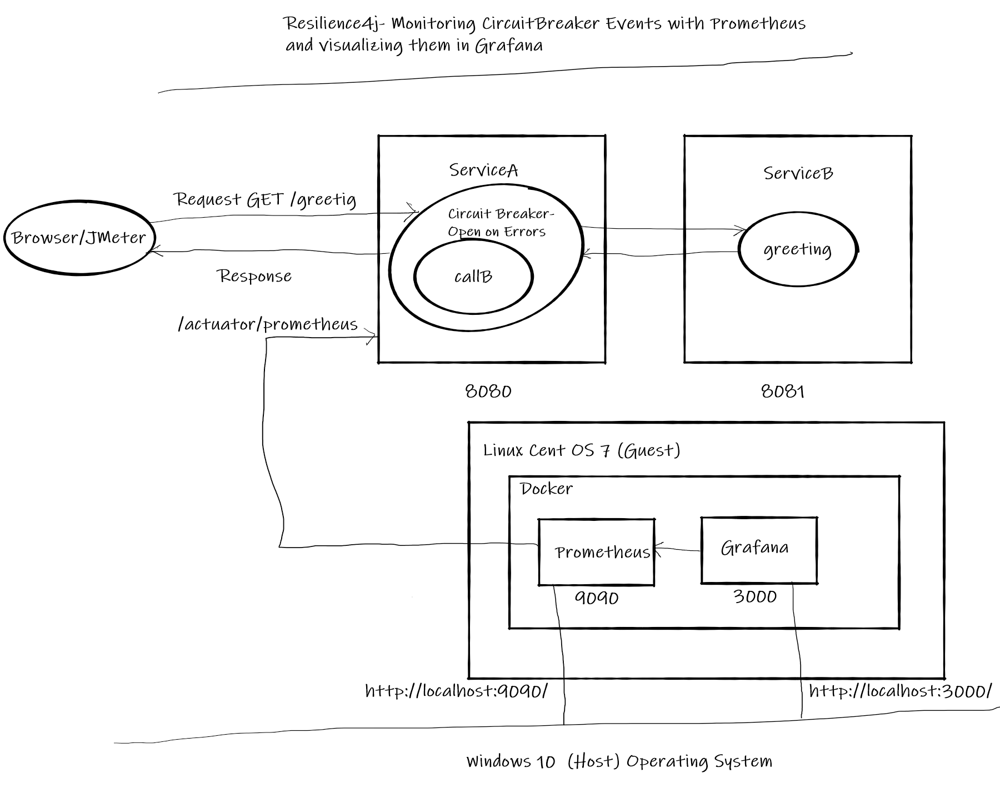
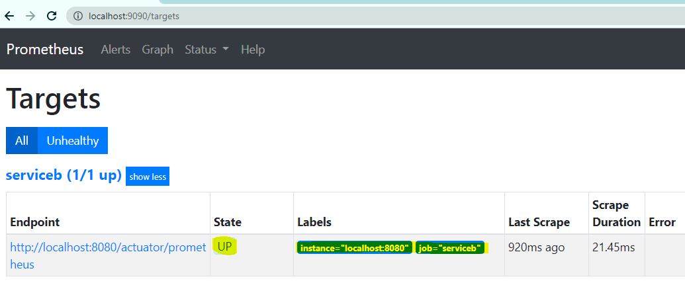
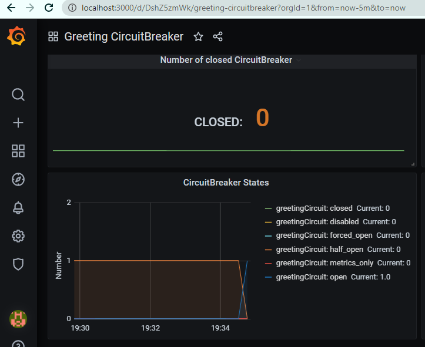
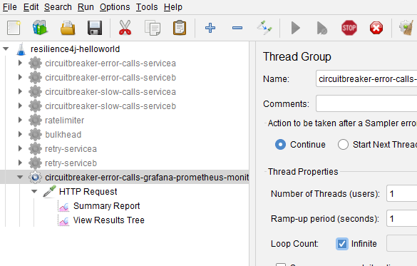

# Resilience4j Session-7  Monitoring CircuitBreaker Events with Prometheus and visualizing them in Grafana
In  this tutorial we are going to learn how to monitor events that are generated by Resilience4j library and visualize them 
in a dashboard. Here we are going to use **Prometheus** to monitor events and **Grafana** for visualization.

In this example we are going to monitor **Circuit Breaker** events that are generated by **ServiceA** when it is receiving more errors
than those are expected from **ServiceB**.

Overview
- User makes a call to get greeting message from  REST API **ServiceA**
- **ServiceA** calls **ServiceB** to fetch greeting message
- Because of some random issue 50% of calls to **ServiceB** results in failure
- When ever **ServiceA** gets error message from **ServiceB** instead of returning error message to client, it will return message from 
a cache.
- When ever error rate increases beyond 50% **ServiceA** doesn't call **ServiceB** until **ServiceB** recovers or **waitDurationInOpenState** is finished.
- **ServiceA** uses **CircuitBreaker** module from **Resilience4j**. When ever there is a change in circuit state and event is generated.
- For every 5 seconds interval Prometheus asks  **ServiceA** for Circuit Breaker events using REST API
- For every 5 seconds interval Garafana updates its dashboard with newly generate event count.
**Note:** We are not going discuss details of Circuit Breaker in this session. Please refer to my previous sessions. 
# Source Code 
- https://github.com/balajich/resilience4j-helloworld/tree/master/circuitbreaker-error-calls-grafana-prometheus-monitor 
# Video
[](https://www.youtube.com/watch?v=4ZVY099kF9A)
- https://youtu.be/4ZVY099kF9A
# Architecture

# Prerequisite
- JDK 1.8 or above
- Apache Maven 3.6.3 or above
- Vagrant 2.2.9 or above- (To start,stop and manage virtual machines)
- Docker version 19.03.13 or above
- docker-compose version 1.18.0 or above
# Step 1: Build
- ``` cd  resilience4j-helloworld\circuitbreaker-error-calls-grafana-prometheus-monitor ```
- ``` mvn clean install ```
# Step 2: Running  Prometheus and Grafana in docker
- ``` cd  resilience4j-helloworld ```
- ``` vagrant up ``` # wait till the virtual machine is up
- ```vagrant ssh -- -R 8080:localhost:8080 ``` # Take ssh to virtual machine and route 
requests from guest 8080 to host 8080 using ssh tunnel. Prometheus that is running in
docker in the virtual machine should be able to access **ServiceB** tomcat to fetch metrics.
- ```sudo su - ``` # Change to root user
- ``` cd /vagrant/circuitbreaker-error-calls-grafana-prometheus-monitor ```
- Start Prometheus and Grafana ``` docker-compose up -d ``` # Run them in background mode
**Note:** If you are running docker on physical machine, Please ignore vagrant and ssh forward commands. 

# Step 3: Run Services
- ``` cd  resilience4j-helloworld\circuitbreaker-error-calls-grafana-prometheus-monitor ```
- **ServiceA**: ```  java -jar .\servicea\target\servicea-0.0.1-SNAPSHOT.jar  ```
- **ServiceB**: ```  java -jar .\serviceb\target\serviceb-0.0.1-SNAPSHOT.jar  ```
# Prometheus metrics endpoint on ServiceA (Tomcat)
- ``` curl -l -s http://localhost:8080/actuator/prometheus ```
Prometheus scrapes metrics from the endpoint "/actuator/prometheus"
# Step 4: Prometheus UI
View the UI to see that it is able to read metrics from **ServiceA**
- http://localhost:9090/targets
- 
Few useful prometheus queries.
- ```sum(resilience4j_circuitbreaker_state{state='closed'}) ``` Get sum of closed circuits
- ```rate(resilience4j_circuitbreaker_calls_seconds_count{instance="localhost:8080",name="greetingCircuit"}[1m]) ```
Counters to track how  many  circuitbreaker events have happened
# Step 5: Grafana UI
Access Garafan UI and use admin/admin as credentails.
- open ```http://localhost:3000/``` 
- **Configure integration with Prometheus**
    - Access configuration
    - Add data source
    - Select Prometheus
    - Use url "http://localhost:9090" and access with value "Browser"
- **Configure dashboard**
    - Access "home"
    - Import dashboard
    - Upload dashboard.json
- 
# Using JMeter to test environment
- JMeter Script is provided to generate call.
- Import **resilience4j-helloworld.jmx** and run **circuitbreaker-error-calls-grafana-prometheus-monitor-servicea** thread group.
- Observe Granfana dashboard for changes in circuit breaker events
- 
# Code
Instrument **ServiceA** to get meterics using dependency. pom.xml of *ServiceA*
```xml
        <dependency>
            <groupId>io.micrometer</groupId>
            <artifactId>micrometer-registry-prometheus</artifactId>
        </dependency>
```
application.yml , Expose mertics endpoint from **ServiceA**. 
```yaml
management.endpoints.web.exposure.include: '*'
management.endpoint.health.show-details: always
management.health.diskspace.enabled: false
management.health.circuitbreakers.enabled: true
management.health.ratelimiters.enabled: false
management.metrics.tags.application: servicea
management.metrics.distribution.percentiles-histogram.http.server.requests: true
management.metrics.distribution.percentiles-histogram.resilience4j.circuitbreaker.calls: true
```
Please refer my previous repos for Circuitbreaker code etc, explaining the docker files and PQL is beyond the scope of
this tutorial.
# References
- https://github.com/resilience4j/resilience4j-spring-boot2-demo
- https://resilience4j.readme.io/docs/circuitbreaker
- https://developer.mozilla.org/en-US/docs/Web/HTTP/Status
- https://www.baeldung.com/resilience4j
- Hands-On Microservices with Spring Boot and Spring Cloud: Build and deploy Java microservices 
using Spring Cloud, Istio, and Kubernetes -Magnus Larsson
# Weblink
- https://eduami.org/Resilience4j/circuitbreaker-error-calls-grafana-prometheus-monitor.html
# Next Tutorial
How to deploy microservices using docker
- https://github.com/balajich/spring-cloud-session-6-microservices-deployment-docker