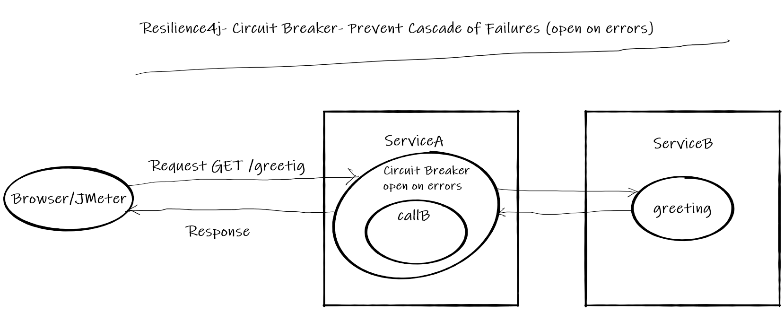
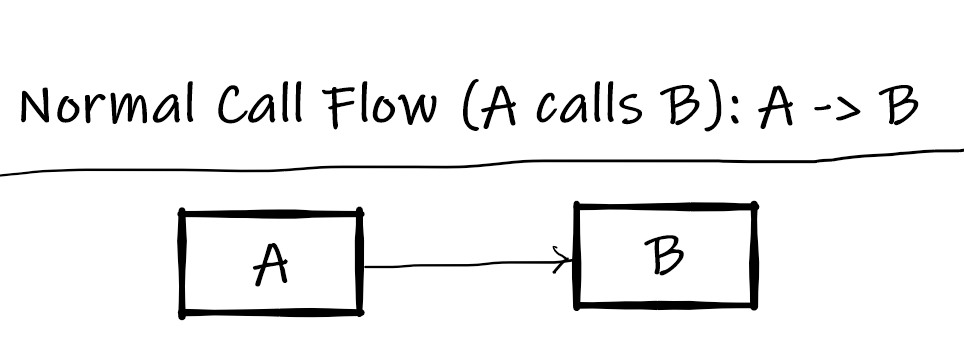
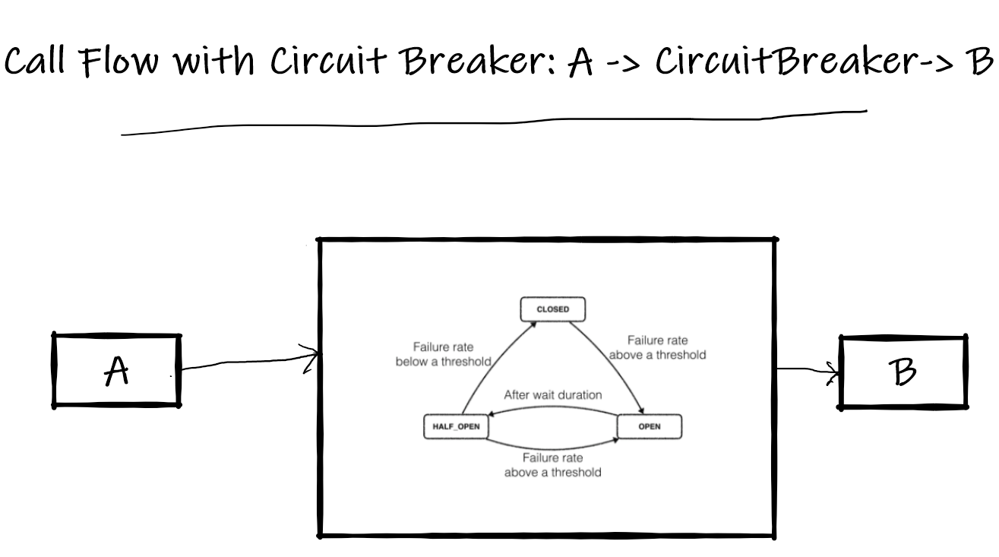
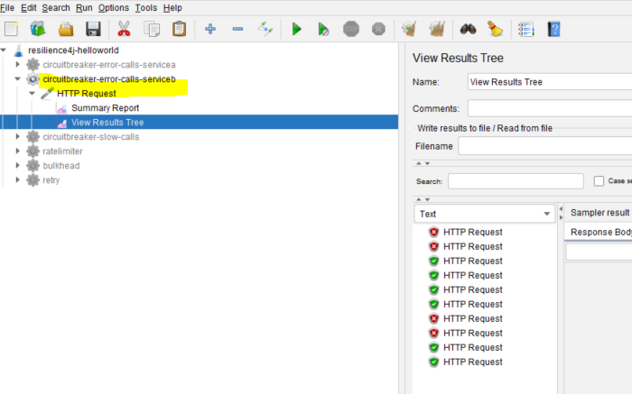
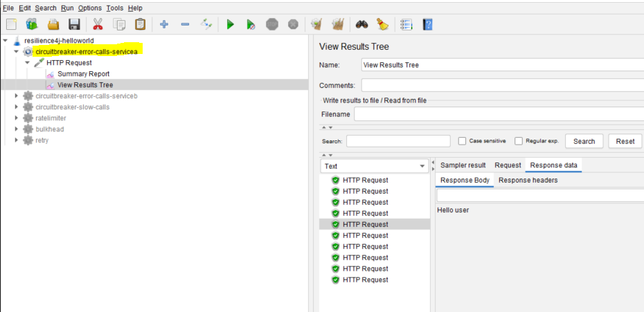

# Resilience4j Session-5  Preventing cascading of failures in REST API using Circuit Breaker 
In  this tutorial we are going to learn how to prevent cascading of failures from one service to other service using 
**Resilience4j Circuit Breaker** module.

For example if a **ServiceA** depends up on **ServiceB**. For some reason **ServiceB** is experiencing error 
instead of repeatedly calling **ServiceB**, the **ServiceA** should take a break (not calling) until **ServiceB** is completely or half recovered.   
 
- Using **Circuit Breaker** we can prevent flow of failures to downstream/upstream.
- This functionality can be achieved easily with annotation **@CircuitBreaker** without writing explicit code. 

Overview
- User makes a call to get greeting message from  REST API **ServiceA**
- **ServiceA** calls **ServiceB** to fetch greeting message
- Because of some random issue 50% of calls to **ServiceB** results in failure
- When ever **ServiceA** gets error message from **ServiceB** instead of returning error message to client, it will return message from 
a cache.
- When ever error rate increases beyond 50% **ServiceA** doesn't call **ServiceB** until **ServiceB** recovers or **waitDurationInOpenState** is finished
- This entire functionality can be achieved with  **Circuit Breaker** pattern
# Source Code 
- [https://github.com/balajich/resilience4j-helloworld/tree/master/circuitbreaker-error-calls](https://github.com/balajich/resilience4j-helloworld/tree/master/circuitbreaker-error-calls) 
# Video
[](https://www.youtube.com/watch?v=_hCyRcJcCks)
- https://youtu.be/_hCyRcJcCks
# Architecture

# Normal Call flow

# Call flow with Circuit Breaker

# Prerequisite
- JDK 1.8 or above
- Apache Maven 3.6.3 or above
# Build
- ``` cd  resilience4j-helloworld\circuitbreaker-error-calls ```
- ``` mvn clean install ```

# Running 
- **ServiceA**: ```  java -jar .\servicea\target\servicea-0.0.1-SNAPSHOT.jar  ```
- **ServiceB**: ```  java -jar .\serviceb\target\serviceb-0.0.1-SNAPSHOT.jar  ```

# Using JMeter to test environment
- JMeter Script is provided to generate call.
- Import **resilience4j-helloworld.jmx** and run **circuitbreaker-error-calls-serviceb** thread group.
- Observe **ServiceB** will generate 50% of errors
- 
- run **circuitbreaker-error-calls-servicea** thread group.
- Observe **ServiceA** will generate 100% of success even **ServiceB** returns errors, Further more it doesn't makes calls 
to **ServiceB** until it recovers.
- 
# Code
Include following artifacts as dependency for spring boot restapi **ServiceA** application. **resilience4j-spring-boot2,
spring-boot-starter-actuator,spring-boot-starter-aop**
**pom.xml** for **ServiceA**
```xml
<dependency>
    <groupId>io.github.resilience4j</groupId>
    <artifactId>resilience4j-spring-boot2</artifactId>
    <version>1.4.0</version>
</dependency>
<dependency>
    <groupId>org.springframework.boot</groupId>
    <artifactId>spring-boot-starter-actuator</artifactId>
</dependency>
<dependency>
    <groupId>org.springframework.boot</groupId>
    <artifactId>spring-boot-starter-aop</artifactId>
</dependency>
```
In **application.yml** of **ServiceA** define the behavior of Circuit Breaker module
- slidingWindowSize: Configures the size of the sliding window which is used to record the outcome of calls when the CircuitBreaker is closed.
- slidingWindowType: Configures the type of the sliding window which is used to record the outcome of calls when the CircuitBreaker is closed
- minimumNumberOfCalls: Configures the minimum number of calls which are required (per sliding window period) before the CircuitBreaker can calculate the error rate or slow call rate.
- waitDurationInOpenState: The time that the CircuitBreaker should wait before transitioning from open to half-open.
- waitDuration: A fixed wait duration between retry attempts
- retryExceptions: Configures a list of error classes that are recorded as a failure and thus are retried.
- failureRateThreshold: Configures the failure rate threshold in percentage.
```yaml
 resilience4j:
     circuitbreaker:
         configs:
             default:
                 slidingWindowSize: 10
                 slidingWindowType: COUNT_BASED
                 minimumNumberOfCalls: 5
                 permittedNumberOfCallsInHalfOpenState: 3
                 automaticTransitionFromOpenToHalfOpenEnabled: true
                 waitDurationInOpenState: 1s
         instances:
             greetingCircuit:
                 baseConfig: default
                 failureRateThreshold: 50
                 recordExceptions:
                     - org.springframework.web.client.HttpServerErrorException
```
```java
 @GetMapping("/greeting")
    @CircuitBreaker(name = "greetingCircuit", fallbackMethod = "greetingFallBack")
    public ResponseEntity greeting(@RequestParam(value = "name", defaultValue = "World") String name) {
        ResponseEntity responseEntity = restTemplate.getForEntity("http://localhost:8081/**ServiceB**greeting?name=" + name, String.class);
        //update cache
        cache = responseEntity.getBody().toString();
        return responseEntity;
    }

    //Invoked when circuit is in open state
    public ResponseEntity greetingFallBack(String name, io.github.resilience4j.circuitbreaker.CallNotPermittedException ex) {
        System.out.println("Circuit is in open state no further calls are accepted");
        //return data from cache
        return ResponseEntity.ok().body(cache);
    }

    //Invoked when call to **ServiceB** failed
    public ResponseEntity greetingFallBack(String name, HttpServerErrorException ex) {
        System.out.println("Exception occurred when call calling service B");
        //return data from cache
        return ResponseEntity.ok().body(cache);
    }
```
**ServiceB** is a simple rest api application, which generates 50% of faiulres
```java
Random random = new Random(-6732303926L);
    @GetMapping("/serviceBgreeting")
    public ResponseEntity greeting(@RequestParam(value = "name", defaultValue = "**ServiceB**") String name) {
        return generateErrorBehavior(name);
    }

    private ResponseEntity generateErrorBehavior(String name) {
        int i = random.nextInt(2);
        if (i == 0) {
            System.out.println("Service B Generated Exception");
            return ResponseEntity.status(HttpStatus.INTERNAL_SERVER_ERROR).body("Service B Generated Exception");
        }
        return ResponseEntity.ok().body("Hello " + name);
    }
```
# Weblink
- https://eduami.org/Resilience4j/circuitbreaker-error-calls.html
# References
- https://resilience4j.readme.io/docs/circuitbreaker
- https://developer.mozilla.org/en-US/docs/Web/HTTP/Status
- https://www.baeldung.com/resilience4j
- Hands-On Microservices with Spring Boot and Spring Cloud: Build and deploy Java microservices 
using Spring Cloud, Istio, and Kubernetes -Magnus Larsson
# Next Tutorial
How to deploy microservices using docker
- https://github.com/balajich/spring-cloud-session-6-microservices-deployment-docker

Resilience4j Building Fault Tolerant REST API 