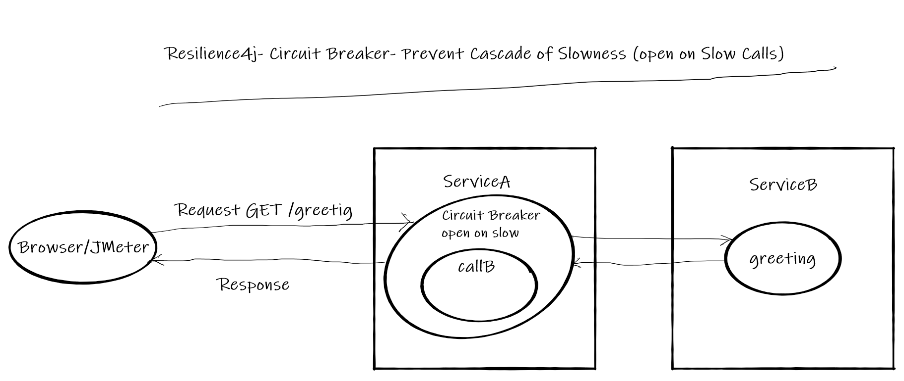
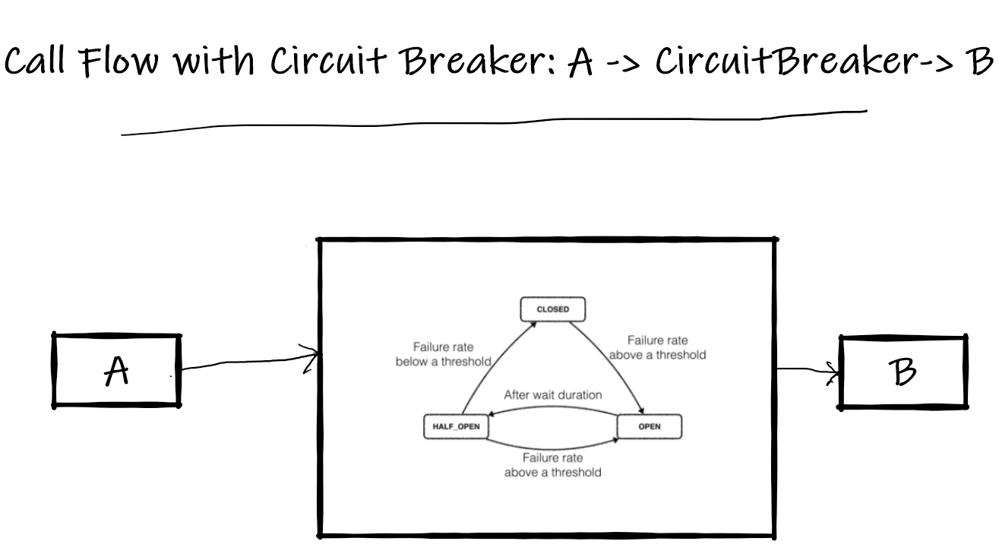

# Resilience4j Session-5  Preventing cascading of slowness in REST API using Circuit Breaker 
In  this tutorial we are going to learn how to prevent cascading of slowness from one service to other service using 
**Resilience4j Circuit Breaker** module.

For example if a **ServiceA** depends up on **ServiceB**. For some reason **ServiceB** is experiencing slowness 
instead of repeatedly calling **ServiceB**, the **ServiceA** should take a break (not calling) until **ServiceB** is completely or half recovered.   

- This functionality can be achieved easily with annotation **@CircuitBreaker** without writing explicit code. 

Overview
- User makes a call to get greeting message from  REST API **ServiceA**
- **ServiceA** calls **ServiceB** to fetch greeting message
- The usual response time of **ServiceB** is 10 milliseconds, Because of some random issue 50% of calls to **ServiceB** takes more than 2 seconds.
- This slowness behavior of **ServiceB** shouldn't impact **ServiceA**.
- When ever **ServiceA** sees 50% (out of 5 ) are taking more than 10 milliseconds, it is not going to call **ServiceB** and returns the response from cachce.
- This entire functionality can be achieved with  **Circuit Breaker** pattern
# Source Code 
- https://github.com/balajich/resilience4j-helloworld/tree/master/circuitbreaker-slow-calls 
# Video
[](https://www.youtube.com/watch?v=WKxV0bmA_eQ)
- https://youtu.be/WKxV0bmA_eQ
# Architecture

# Normal Call flow

# Call flow with Circuit Breaker

# Prerequisite
- JDK 1.8 or above
- Apache Maven 3.6.3 or above
# Build
- ``` cd  resilience4j-helloworld\circuitbreaker-slow-calls ```
- ``` mvn clean install ```

# Running 
- **ServiceA**: ```  java -jar .\servicea\target\servicea-0.0.1-SNAPSHOT.jar  ```
- **ServiceB**: ```  java -jar .\serviceb\target\serviceb-0.0.1-SNAPSHOT.jar  ```

# Using JMeter to test environment
- JMeter Script is provided to generate call.
- Import **resilience4j-helloworld.jmx** and run **circuitbreaker-slow-calls-serviceb** thread group.
- This will generate 20 requests and Observe 50% of calls are taking 2 seconds and average response time 1.014 seconds
- 
- run **circuitbreaker-error-calls-servicea** thread group.
- Observe the average response time is significantly dropped to 0.214 seconds
- The reason for improvement in performance is. The **ServiceA** doesn't call **ServiceB** when there is a drop in performance instead
it serves from a cache. 
- 

# Code
Include following artifacts as dependency for spring boot restapi serviceA application. **resilience4j-spring-boot2,
spring-boot-starter-actuator,spring-boot-starter-aop**
**pom.xml** of **ServiceA**
```xml
<dependency>
    <groupId>io.github.resilience4j</groupId>
    <artifactId>resilience4j-spring-boot2</artifactId>
    <version>1.4.0</version>
</dependency>
<dependency>
    <groupId>org.springframework.boot</groupId>
    <artifactId>spring-boot-starter-actuator</artifactId>
</dependency>
<dependency>
    <groupId>org.springframework.boot</groupId>
    <artifactId>spring-boot-starter-aop</artifactId>
</dependency>
```
In **application.yml** of serviceA define the behavior of Circuit Breaker module
- slidingWindowSize: Configures the size of the sliding window which is used to record the outcome of calls when the CircuitBreaker is closed.
- slidingWindowType: Configures the type of the sliding window which is used to record the outcome of calls when the CircuitBreaker is closed
- minimumNumberOfCalls: Configures the minimum number of calls which are required (per sliding window period) before the CircuitBreaker can calculate the error rate or slow call rate.
- waitDurationInOpenState: The time that the CircuitBreaker should wait before transitioning from open to half-open.
- slowCallRateThreshold: Configures a threshold in percentage. The CircuitBreaker considers a call as slow when the call duration is greater than slowCallDurationThreshold
- slowCallDurationThreshold: Configures the duration threshold above which calls are considered as slow and increase the rate of slow calls.
```yaml
 resilience4j:
     circuitbreaker:
         configs:
             default:
                 slidingWindowSize: 10
                 slidingWindowType: COUNT_BASED
                 minimumNumberOfCalls: 5
                 permittedNumberOfCallsInHalfOpenState: 3
                 automaticTransitionFromOpenToHalfOpenEnabled: true
                 waitDurationInOpenState: 5s
         instances:
             greetingCircuitSlow:
                 baseConfig: default
                 slowCallRateThreshold: 50
                 slowCallDurationThreshold: 10ms
```
```java
 @GetMapping("/greeting")
     @CircuitBreaker(name = "greetingCircuitSlow", fallbackMethod = "greetingFallBack")
     public ResponseEntity greeting(@RequestParam(value = "name", defaultValue = "World") String name) {
         ResponseEntity responseEntity = restTemplate.getForEntity("http://localhost:8081/serviceBgreeting?name=" + name, String.class);
         //update cache
         cache = responseEntity.getBody().toString();
         return responseEntity;
     }
 
     //Invoked when circuit is in open state
     public ResponseEntity greetingFallBack(String name, io.github.resilience4j.circuitbreaker.CallNotPermittedException ex) {
         System.out.println("Circuit is in open state no further calls are accepted");
         //return data from cache
         return ResponseEntity.ok().body(cache);
     }
 
     //Invoked when call to serviceB failed
     public ResponseEntity greetingFallBack(String name, HttpServerErrorException ex) {
         System.out.println("Exception occurred when call calling service B");
         //return data from cache
         return ResponseEntity.ok().body(cache);
     }
```
****ServiceB**** is a simple rest api application, where 50% of calls take 2 seconds
```java
Random random = new Random(-6732303926L);
    @GetMapping("/serviceBgreeting")
    public ResponseEntity greeting(@RequestParam(value = "name", defaultValue = "serviceB") String name) {
        return generateSlowBehavior(name);
    }

    private ResponseEntity generateSlowBehavior(String name) {
        int i = random.nextInt(2);
        if (i == 0) {
            try {
                Thread.sleep(2*1000);//sleep for two seconds
            } catch (InterruptedException interruptedException) {
                interruptedException.printStackTrace();
            }
        }//end of if
        return ResponseEntity.ok().body("Hello " + name);
    }
```

# References
- https://resilience4j.readme.io/docs/circuitbreaker
- https://developer.mozilla.org/en-US/docs/Web/HTTP/Status
- https://www.baeldung.com/resilience4j
- Hands-On Microservices with Spring Boot and Spring Cloud: Build and deploy Java microservices 
using Spring Cloud, Istio, and Kubernetes -Magnus Larsson
# Next Tutorial
How to deploy microservices using docker
- https://github.com/balajich/spring-cloud-session-6-microservices-deployment-docker