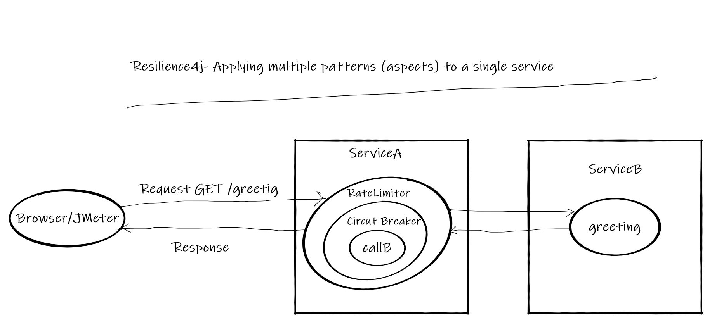
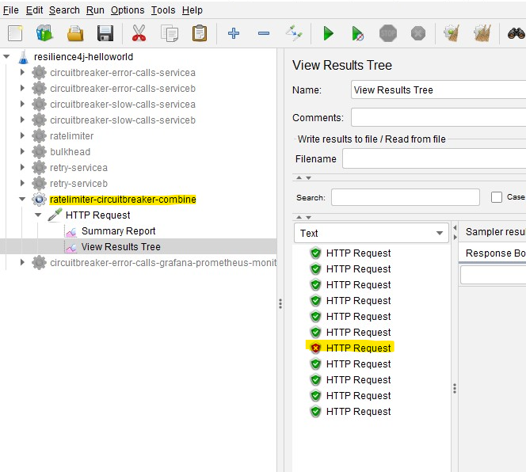

# Resilience4j Session-6  Applying multiple patterns (aspects) to a single service 
In  this tutorial we are going to learn how to add  both **Ratelimiter** and **CircuitBreaker** patterns to a single service. 

- Using **Ratelimiter** limit the number of call that a service can handle.
- Using **Circuit Breaker** we can prevent flow of failures to downstream/upstream.

Overview
- User makes a call to get greeting message from  REST API **ServiceA**
- Limit **ServiceA** to handle only 10 calls per second.
- **ServiceA** calls **ServiceB** to fetch greeting message
- Because of some random issue 50% of calls to **ServiceB** results in failure.
- When ever **ServiceA** gets error message from **ServiceB** instead of returning error message to client, it will return message from 
a cache.
- When ever error rate increases beyond 50% **ServiceA** doesn't call **ServiceB** until **ServiceB** recovers or **waitDurationInOpenState** is finished
- This entire functionality can be achieved with  **Circuit Breaker** and **Ratelimiter** pattern combined.
# Source Code 
- https://github.com/balajich/resilience4j-helloworld/tree/master/ratelimiter-circuitbreaker-combine 
# Video
[](https://www.youtube.com/watch?v=ppOZ01vUhaw)
- https://youtu.be/ppOZ01vUhaw
# Architecture

# Prerequisite
- JDK 1.8 or above
- Apache Maven 3.6.3 or above
# Build
- ``` cd  resilience4j-helloworld\ratelimiter-circuitbreaker-combine ```
- ``` mvn clean install ```

# Running 
- **ServiceA**: ```  java -jar .\servicea\target\servicea-0.0.1-SNAPSHOT.jar  ```
- **ServiceB**: ```  java -jar .\serviceb\target\serviceb-0.0.1-SNAPSHOT.jar  ```

# Using JMeter to test environment
- JMeter Script is provided to generate call.
- Import **resilience4j-helloworld.jmx** and run **ratelimiter-circuitbreaker-combine** thread group.
- 
- Observe only 10 calls are successful and rest 1 failed
# Code
Include following artifacts as dependency for spring boot restapi **ServiceA** application. **resilience4j-spring-boot2,
spring-boot-starter-actuator,spring-boot-starter-aop**
**pom.xml** for **ServiceA**
```xml
<dependency>
    <groupId>io.github.resilience4j</groupId>
    <artifactId>resilience4j-spring-boot2</artifactId>
    <version>1.4.0</version>
</dependency>
<dependency>
    <groupId>org.springframework.boot</groupId>
    <artifactId>spring-boot-starter-actuator</artifactId>
</dependency>
<dependency>
    <groupId>org.springframework.boot</groupId>
    <artifactId>spring-boot-starter-aop</artifactId>
</dependency>
```
In **application.yml** of **ServiceA** define the behavior of Circuit Breaker and Ratelimiter module
```yaml
resilience4j:
    circuitbreaker:
        circuitBreakerAspectOrder: 2
        configs:
            default:
                slidingWindowSize: 10
                slidingWindowType: COUNT_BASED
                minimumNumberOfCalls: 5
                permittedNumberOfCallsInHalfOpenState: 3
                automaticTransitionFromOpenToHalfOpenEnabled: true
                waitDurationInOpenState: 1s
        instances:
            greetingCircuit:
                baseConfig: default
                failureRateThreshold: 50
                recordExceptions:
                    - org.springframework.web.client.HttpServerErrorException
    ratelimiter:
        rateLimiterAspectOrder: 1
        configs:
            default:
                limitForPeriod: 10
                limitRefreshPeriod: 1s
                timeoutDuration: 0
        instances:
            greetingRateLimit:
                baseConfig: default
```
```java
 @GetMapping("/greeting")
     @RateLimiter(name = "greetingRateLimit", fallbackMethod = "greetingFallBack")
     @CircuitBreaker(name = "greetingCircuit", fallbackMethod = "greetingFallBack")
     public ResponseEntity greeting(@RequestParam(value = "name", defaultValue = "World") String name) {
         ResponseEntity responseEntity = restTemplate.getForEntity("http://localhost:8081/serviceBgreeting?name=" + name, String.class);
         //update cache
         cache = responseEntity.getBody().toString();
         return responseEntity;
     }
 
     //Invoked when circuit is in open state
     public ResponseEntity greetingFallBack(String name, io.github.resilience4j.circuitbreaker.CallNotPermittedException ex) {
         System.out.println("Circuit is in open state no further calls are accepted");
         //return data from cache
         return ResponseEntity.ok().body(cache);
     }
 
     //Invoked when call to serviceB failed
     public ResponseEntity greetingFallBack(String name, HttpServerErrorException ex) {
         System.out.println("Exception occurred when call calling service B");
         //return data from cache
         return ResponseEntity.ok().body(cache);
     }
 
     //Invoked when Ratelimter is applied
     public ResponseEntity greetingFallBack(String name, io.github.resilience4j.ratelimiter.RequestNotPermitted ex) {
         System.out.println("Rate limit applied no further calls are accepted");
 
         HttpHeaders responseHeaders = new HttpHeaders();
         responseHeaders.set("Retry-After", "1"); //retry after one second
 
         return ResponseEntity.status(HttpStatus.TOO_MANY_REQUESTS)
                 .headers(responseHeaders) //send retry header
                 .body("Too many request - No further calls are accepted");
     }
```
**ServiceB** is a simple rest api application, which generates 50% of faiulres
```java
Random random = new Random(-6732303926L);
    @GetMapping("/serviceBgreeting")
    public ResponseEntity greeting(@RequestParam(value = "name", defaultValue = "**ServiceB**") String name) {
        return generateErrorBehavior(name);
    }

    private ResponseEntity generateErrorBehavior(String name) {
        int i = random.nextInt(2);
        if (i == 0) {
            System.out.println("Service B Generated Exception");
            return ResponseEntity.status(HttpStatus.INTERNAL_SERVER_ERROR).body("Service B Generated Exception");
        }
        return ResponseEntity.ok().body("Hello " + name);
    }
```
# Weblink
- https://eduami.org/Resilience4j/ratelimiter-circuitbreaker-combine.html
# References
- https://resilience4j.readme.io/docs/circuitbreaker
- https://developer.mozilla.org/en-US/docs/Web/HTTP/Status
- https://www.baeldung.com/resilience4j
- Hands-On Microservices with Spring Boot and Spring Cloud: Build and deploy Java microservices 
using Spring Cloud, Istio, and Kubernetes -Magnus Larsson
# Next Tutorial
How to deploy microservices using docker
- https://github.com/balajich/spring-cloud-session-6-microservices-deployment-docker

Resilience4j Building Fault Tolerant REST API 