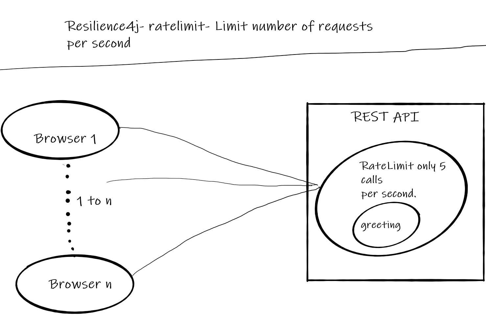
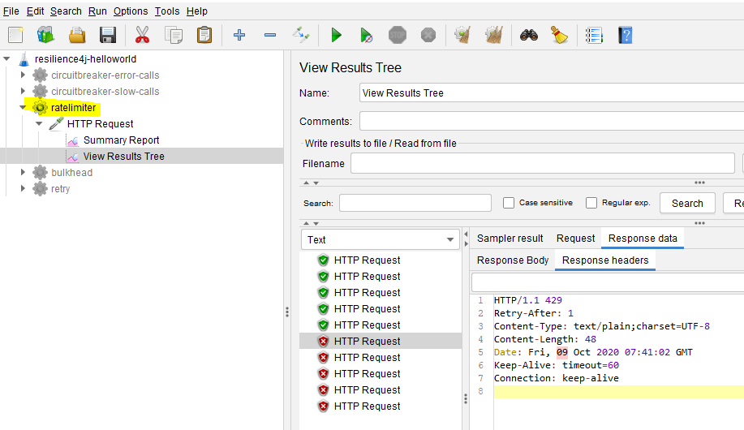

# Resilience4j- Session-1 Limit number of requests to RESTAPI using ratelimiter 
In  this tutorial we are going to learn how to limit number of requests that a restapi can handle in a fixed duration. 
There are several reasons to limit number of calls than an api can hanlde,few of them are.
- To meet service level agreement
- Protect resources from an overload and Denial of Service (DoS) attacks

Overview
- Using **Ratelimit** limit the number of call that a service can handle.
- This functionality can be achieved easily with annotation **@RateLimiter** without writing explicit code. 

Overview
- User makes a call to greeting RESTAPI to get a greeting message.
- **greeting** can only handle 5 requests in a second.
- This limitation can be set on greeting method using annotation **@RateLimiter**
- if the method receives more than 5 requests an exception **io.github.resilience4j.ratelimiter.RequestNotPermitted** is thrown
and user is served with HTTP status code 429 (Too Many Requests)  
# Source Code 
- [https://github.com/balajich/resilience4j-helloworld/tree/master/ratelimiter](https://github.com/balajich/resilience4j-helloworld/tree/master/ratelimiter) 
# Video
[](https://www.youtube.com/watch?v=j9cH01mlK6k)
- https://youtu.be/j9cH01mlK6k
# Architecture

# Prerequisite
- User should have basic understanding of RESTAPI and Spring boot
- JDK 1.8 or above
- Apache Maven 3.6.3 or above
# Build
- ``` cd  resilience4j-helloworld ```
- ``` mvn clean install ```

# Running RESTAPI
- REST API Server: ``` java -jar .\ratelimiter\target\ratelimiter-0.0.1-SNAPSHOT.jar ```

# Using JMeter to generate more than 5 calls in a second
- JMeter Script is provided to generate  calls
-  Import **resilience4j-helloworld.jmx** and run **ratelimiter** thread group.
- 
# Code
Include following artifacts as dependency for spring boot restapi application. **resilience4j-spring-boot2,
spring-boot-starter-actuator,spring-boot-starter-aop**
**pom.xml** of  ratelimiter 
```xml
<dependency>
    <groupId>io.github.resilience4j</groupId>
    <artifactId>resilience4j-spring-boot2</artifactId>
    <version>1.4.0</version>
</dependency>
<dependency>
    <groupId>org.springframework.boot</groupId>
    <artifactId>spring-boot-starter-actuator</artifactId>
</dependency>
<dependency>
    <groupId>org.springframework.boot</groupId>
    <artifactId>spring-boot-starter-aop</artifactId>
</dependency>
```
In **application.yml**  define the behavior of ratelimiter module
- limitForPeriod: The number of calls allowed during period.
- limitRefreshPeriod: Reset the limit period .
- timeoutDuration: Duration for which request should wait.
```yaml
resilience4j:
    ratelimiter:
        configs:
            default:
                limitForPeriod: 5
                limitRefreshPeriod: 1s
                timeoutDuration: 0
        instances:
            greetingRateLimit:
                baseConfig: default
```
```java
    @GetMapping("/greeting")
    @RateLimiter(name = "greetingRateLimit", fallbackMethod = "greetingFallBack")
    public ResponseEntity greeting(@RequestParam(value = "name", defaultValue = "World") String name) {
        return ResponseEntity.ok().body("Hello World: " + name);
    }


    public ResponseEntity greetingFallBack(String name, io.github.resilience4j.ratelimiter.RequestNotPermitted ex) {
        System.out.println("Rate limit applied no further calls are accepted");

        HttpHeaders responseHeaders = new HttpHeaders();
        responseHeaders.set("Retry-After", "1"); //retry after one second

        return ResponseEntity.status(HttpStatus.TOO_MANY_REQUESTS)
                .headers(responseHeaders) //send retry header
                .body("Too many request - No further calls are accepted");
    }
```

# References
- https://developer.mozilla.org/en-US/docs/Web/HTTP/Status
- https://www.baeldung.com/resilience4j
- Hands-On Microservices with Spring Boot and Spring Cloud: Build and deploy Java microservices 
using Spring Cloud, Istio, and Kubernetes -Magnus Larsson
# Next Tutorial
How to deploy microservices using docker
- https://github.com/balajich/spring-cloud-session-6-microservices-deployment-docker