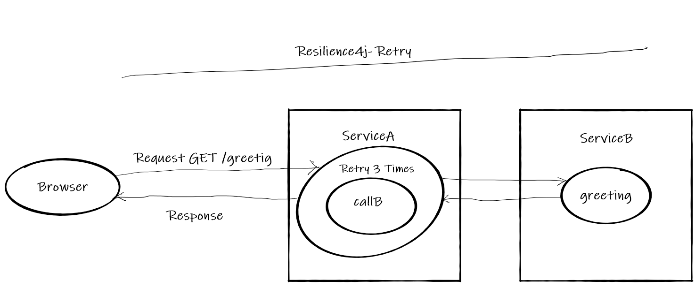
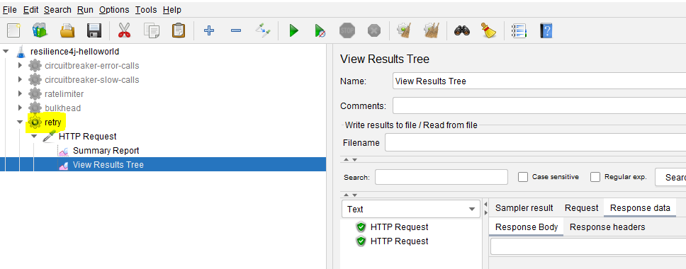

# Resilience4j Session-3  Making RESTAPI fault tolerant using Retry 
In  this tutorial we are going to learn how make spring boot based RESTAPI fault tolerant. Under certain circumstances we 
observe that subsystem works well when we retry the same request. To handle such scenarios we can use **resilience4j retry**
module.
- Using **Retry module** automatically retry a failed call.
- This functionality can be achieved easily with annotation **@Retry** without writing explicit code. 

Overview
- User makes a call to greeting RESTAPI to get a greeting message.
- **greeting** method  returns valid response only when called three times else it will throw **RuntimeException**.
- This behavior can be easily handled with annotation **Retry**
# Source Code 
- [https://github.com/balajich/resilience4j-helloworld/tree/master/retry](https://github.com/balajich/resilience4j-helloworld/tree/master/retry) 
# Video
[](https://www.youtube.com/watch?v=vKIELihjRjY)
- https://youtu.be/vKIELihjRjY**
# Architecture

# Prerequisite
- JDK 1.8 or above
- Apache Maven 3.6.3 or above
# Build
- ``` cd  resilience4j-helloworld ```
- ``` mvn clean install ```

# Running RESTAPI
- REST API Server: ``` java -jar .\retry\target\retry-0.0.1-SNAPSHOT.jar ```

# Using curl to test environment
- Call Greeting API: ``` curl -s -L  http://localhost:8080/greeting ```
# Using JMeter to test environment
- JMeter Script is provided to generate two successive calls.
-  Import **resilience4j-helloworld.jmx** and run **retry** thread group.
- 
# Code
Include following artifacts as dependency for spring boot restapi application. **resilience4j-spring-boot2,
spring-boot-starter-actuator,spring-boot-starter-aop**
**pom.xml** for retry restapi 
```xml
<dependency>
    <groupId>io.github.resilience4j</groupId>
    <artifactId>resilience4j-spring-boot2</artifactId>
    <version>1.4.0</version>
</dependency>
<dependency>
    <groupId>org.springframework.boot</groupId>
    <artifactId>spring-boot-starter-actuator</artifactId>
</dependency>
<dependency>
    <groupId>org.springframework.boot</groupId>
    <artifactId>spring-boot-starter-aop</artifactId>
</dependency>
```
In **application.yml** of define the behavior of retry module
- maxAttempts: The maximum number of retry attempts
- waitDuration: A fixed wait duration between retry attempts
- retryExceptions: Configures a list of error classes that are recorded as a failure and thus are retried.
Retry function will be invoked a maximum of three times. For each and every successive invocation  it will wait for 100
milliseconds. A retry will happen only when  **java.lang.RuntimeException** is thrown.
```yaml
 resilience4j:
     retry:
         configs:
             default:
                 maxAttempts: 3
                 waitDuration: 100ms
                 retryExceptions:
                     - java.lang.RuntimeException
         instances:
             greetingRetry:
                 baseConfig: default
```
```java
@GetMapping("/greeting")
    @Retry(name = "greetingRetry")
    public ResponseEntity greeting(@RequestParam(value = "name", defaultValue = "World") String name) {
        // This method returns Hello World only when called three times
        Integer calledCount = count.get();
        System.out.println(String.format("Called count %d", calledCount));
        if (calledCount < 2) {
            count.set(++calledCount);
            throw new RuntimeException("Unable to serve request");
        }
        return ResponseEntity.ok().body("Hello World: " + name);
    }
```

# References
- https://developer.mozilla.org/en-US/docs/Web/HTTP/Status
- https://www.baeldung.com/resilience4j
- Spring Microservices in Action by John Carnell 
- Hands-On Microservices with Spring Boot and Spring Cloud: Build and deploy Java microservices 
using Spring Cloud, Istio, and Kubernetes -Magnus Larsson
# Next Tutorial
How to deploy microservices using docker
- https://github.com/balajich/spring-cloud-session-6-microservices-deployment-docker