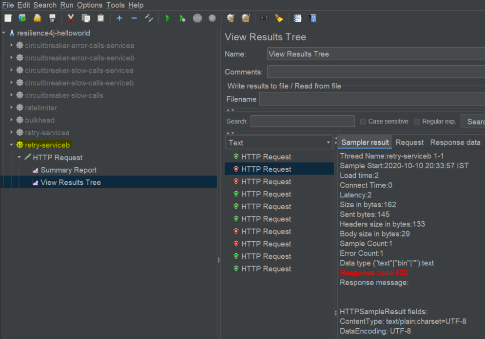

# Resilience4j Session-3  Making RESTAPI fault tolerant using Retry 
In  this tutorial we are going to learn how make spring boot based RESTAPI fault tolerant. Under certain circumstances we 
observe that subsystem works well when we retry the same request. To handle such scenarios we can use **resilience4j retry**
module.
- Using **Retry module** automatically retry a failed call.
- This functionality can be achieved easily with annotation **@Retry** without writing explicit code. 

Overview
- User makes a call to get greeting message from  REST API ServiceA
- ServiceA calls ServiceB to fetch greeting message
- Because of some random issue 50% of calls to ServiceB results in failure
- When ever ServiceA gets error message from ServiceB instead of returning error message to client,it will retry three times.
- Even after three time if ServiceB returns error , error is retuned to user.
- This entire functionality can be achieved without writing explicit code using Retry. 
# Source Code 
- [https://github.com/balajich/resilience4j-helloworld/tree/master/retry](https://github.com/balajich/resilience4j-helloworld/tree/master/retry) 
# Video
[](https://www.youtube.com/watch?v=b6g5FqFuvrs)
- https://youtu.be/b6g5FqFuvrs
# Architecture

# Prerequisite
- JDK 1.8 or above
- Apache Maven 3.6.3 or above
# Build
- ``` cd  resilience4j-helloworld\retry ```
- ``` mvn clean install ```

# Running RESTAPI
- **ServiceA**: ```  java -jar .\servicea\target\servicea-0.0.1-SNAPSHOT.jar  ```
- **ServiceB**: ```  java -jar .\serviceb\target\serviceb-0.0.1-SNAPSHOT.jar  ```

# Using JMeter to test environment
- JMeter Script is provided to generate call.
- Import **resilience4j-helloworld.jmx** and run **retry-serviceb** thread group.
- Observe **ServiceB** will generate 50% of errors
- 
- run **retry-servicea** thread group.
- Observe **ServiceA** will generate 100% of success even **ServiceB** returns errors, This is because when **ServiceA** gets error
from **ServiceB** it retries.
- 
# Code
Include following artifacts as dependency for spring boot restapi application. **resilience4j-spring-boot2,
spring-boot-starter-actuator,spring-boot-starter-aop**
**pom.xml** for **ServiceA** 
```xml
<dependency>
    <groupId>io.github.resilience4j</groupId>
    <artifactId>resilience4j-spring-boot2</artifactId>
    <version>1.4.0</version>
</dependency>
<dependency>
    <groupId>org.springframework.boot</groupId>
    <artifactId>spring-boot-starter-actuator</artifactId>
</dependency>
<dependency>
    <groupId>org.springframework.boot</groupId>
    <artifactId>spring-boot-starter-aop</artifactId>
</dependency>
```
In **application.yml** of define the behavior of retry module
- maxAttempts: The maximum number of retry attempts
- waitDuration: A fixed wait duration between retry attempts
- retryExceptions: Configures a list of error classes that are recorded as a failure and thus are retried.
Retry function will be invoked a maximum of three times. For each and every successive invocation  it will wait for 100
milliseconds. A retry will happen only when  **org.springframework.web.client.HttpServerErrorException** is thrown by **ServiceB**.
```yaml
 resilience4j:
     retry:
         configs:
             default:
                 maxAttempts: 3
                 waitDuration: 100ms
                 retryExceptions:
                     - org.springframework.web.client.HttpServerErrorException
         instances:
             greetingRetry:
                 baseConfig: default
```
```java
@GetMapping("/greeting")
    @Retry(name = "greetingRetry")
    public ResponseEntity greeting(@RequestParam(value = "name", defaultValue = "World") String name) {
        System.out.println("Greeting method is invoked");
        ResponseEntity responseEntity = restTemplate.getForEntity("http://localhost:8081/**ServiceB**greeting?name=" + name, String.class);
        //update cache
        return responseEntity;
    }
```
**ServiceB** is a simple springboot based REST API application. With generates 50% errors
```java
 Random random = new Random(-6732303926L);
    @GetMapping("/**ServiceB**greeting")
    public ResponseEntity greeting(@RequestParam(value = "name", defaultValue = "**ServiceB**") String name) {
        return generateErrorBehavior(name);
    }

    private ResponseEntity generateErrorBehavior(String name) {
        int i = random.nextInt(2);
        if (i == 0) {
            System.out.println("Service B Generated Exception");
            return ResponseEntity.status(HttpStatus.INTERNAL_SERVER_ERROR).body("Service B Generated Exception");
        }
        return ResponseEntity.ok().body("Hello " + name);
    }
``` 


# References
- https://resilience4j.readme.io/docs/circuitbreaker
- https://developer.mozilla.org/en-US/docs/Web/HTTP/Status
- https://www.baeldung.com/resilience4j
- Hands-On Microservices with Spring Boot and Spring Cloud: Build and deploy Java microservices 
using Spring Cloud, Istio, and Kubernetes -Magnus Larsson
# Web Link
- https://eduami.org/Resilience4j/retry.html
# Next Tutorial
How to deploy microservices using docker
- https://github.com/balajich/spring-cloud-session-6-microservices-deployment-docker