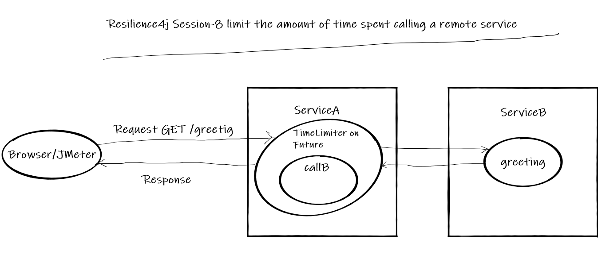

# Resilience4j Session-8 limit the amount of time spent calling a remote service 
In  this tutorial we are going to learn how to limit the amount of time spent calling a remote service using   
**Resilience4j TimeLimiter** module.

For example if a **ServiceA** depends up on **ServiceB**. For some reason **ServiceB** is experiencing slowness 
instead of waiting endlessly for **ServiceB** to return. **ServiceA** will wait only for stipulated amount of time.  

- This functionality can be achieved easily with annotation **@TimeLimiter** without writing explicit code. 

Overview
- User makes a call to get greeting message from  REST API **ServiceA**
- **ServiceA** calls **ServiceB** to fetch greeting message
- The usual response time of **ServiceB** is 10 milliseconds, Because of some random issue 50% of calls to **ServiceB** takes more than 2 seconds.
- This slowness behavior of **ServiceB** shouldn't impact **ServiceA** and its customers.
- When ever **ServiceA** sees a call to **ServiceB** taking more than 1 second, it cancels the call and return the data.
- In our example we return data from cache for slow calls instead of giving exception to client.
# Source Code 
- https://github.com/balajich/resilience4j-helloworld/tree/master/timelimiter-slow-calls 
# Video
[](https://www.youtube.com/watch?v=ZqQiyiVDBc0)
- https://youtu.be/ZqQiyiVDBc0
# Architecture

# Prerequisite
- JDK 1.8 or above
- Apache Maven 3.6.3 or above
# Build
- ``` cd  resilience4j-helloworld\timelimiter-slow-calls ```
- ``` mvn clean install ```

# Running 
- **ServiceA**: ```  java -jar .\servicea\target\servicea-0.0.1-SNAPSHOT.jar  ```
- **ServiceB**: ```  java -jar .\serviceb\target\serviceb-0.0.1-SNAPSHOT.jar  ```

# Using JMeter to test environment
- JMeter Script is provided to generate call.
- Import **resilience4j-helloworld.jmx** and run **timelimiter-slow-calls** thread group.
- This will generate 10 requests
- 

# Code
Include following artifacts as dependency for spring boot restapi serviceA application. **resilience4j-spring-boot2,
spring-boot-starter-actuator,spring-boot-starter-aop**
**pom.xml** of **ServiceA**
```xml
<dependency>
    <groupId>io.github.resilience4j</groupId>
    <artifactId>resilience4j-spring-boot2</artifactId>
    <version>1.4.0</version>
</dependency>
<dependency>
    <groupId>org.springframework.boot</groupId>
    <artifactId>spring-boot-starter-actuator</artifactId>
</dependency>
<dependency>
    <groupId>org.springframework.boot</groupId>
    <artifactId>spring-boot-starter-aop</artifactId>
</dependency>
```
In **application.yml** of serviceA define the behavior of TimeLimiter and Bulkhead module
- timeoutDuration- The amount time calling service needs to wait before generating timeout exception
- cancelRunningFuture- Cancel the Running Feature object

**Note**: Bulkhead module is added because TimeLimiter needs separate execution thread instead of request thread
```yaml
resilience4j:
    timelimiter:
        configs:
            default:
                timeoutDuration: 1000
                cancelRunningFuture: true
        instances:
            timelimiterSlow:
                baseConfig: default
    bulkhead:
        configs:
            default:
                maxConcurrentCalls: 5
                maxWaitDuration: 0
        instances:
            greetingBulkhead:
                baseConfig: default
```
**Annotation Approach**: Greeting request controller of **ServiceA**
```java
 @GetMapping("/greeting")
     @TimeLimiter(name = "timelimiterSlow", fallbackMethod = "greetingFallBack")
     @Bulkhead(name = "greetingBulkhead", fallbackMethod = "greetingFallBack", type = Bulkhead.Type.THREADPOOL)
     public CompletableFuture<String> greeting(@RequestParam(value = "name", defaultValue = "World") String name) {
         String result = restTemplate.getForEntity("http://localhost:8081/serviceBgreeting?name=" + name, String.class).getBody().toString();
         cache = result;//update cache
         return CompletableFuture.completedFuture(result);
     }
 
 
     //Invoked when call to serviceB timeout
     private CompletableFuture<String> greetingFallBack(String name, Exception ex) {
         System.out.println("Call to serviceB is timed out");
         //return data from cache
         return CompletableFuture.completedFuture(cache);
     }
```
**Higher order decorator functions**: Greeting request controller functional style of **ServiceA**
```java
 TimeLimiterConfig config = TimeLimiterConfig.custom()
                                                .timeoutDuration(Duration.ofSeconds(1))
                                                .cancelRunningFuture(true)
                                                .build();
    private String cache = null;

    @Autowired
    RestTemplate restTemplate;

    @GetMapping("/greetingFunctional")
    public ResponseEntity<String> greeting(@RequestParam(value = "name", defaultValue = "World") String name) {
        String result = null;
        try {
            TimeLimiter timeLimiter = TimeLimiter.of(config);
            result = timeLimiter.executeFutureSupplier(
                    () -> CompletableFuture.supplyAsync(() -> restTemplate.getForEntity("http://localhost:8081/serviceBgreeting?name=" + name, String.class).getBody()));
            cache = result;
        } catch (Exception e) {
            // request time out
            result = cache;

        }
        return ResponseEntity.ok().body(result);
    }
```
# Important Notes
- To decorate a TimeLimiter the method needs to return Future
- TimeLimiter annotation cannot cancel Future
# References
- https://resilience4j.readme.io/docs/timeout
- https://reflectoring.io/time-limiting-with-resilience4j/
- https://www.baeldung.com/resilience4j
# Next Tutorial
How to deploy microservices using docker
- https://github.com/balajich/spring-cloud-session-6-microservices-deployment-docker